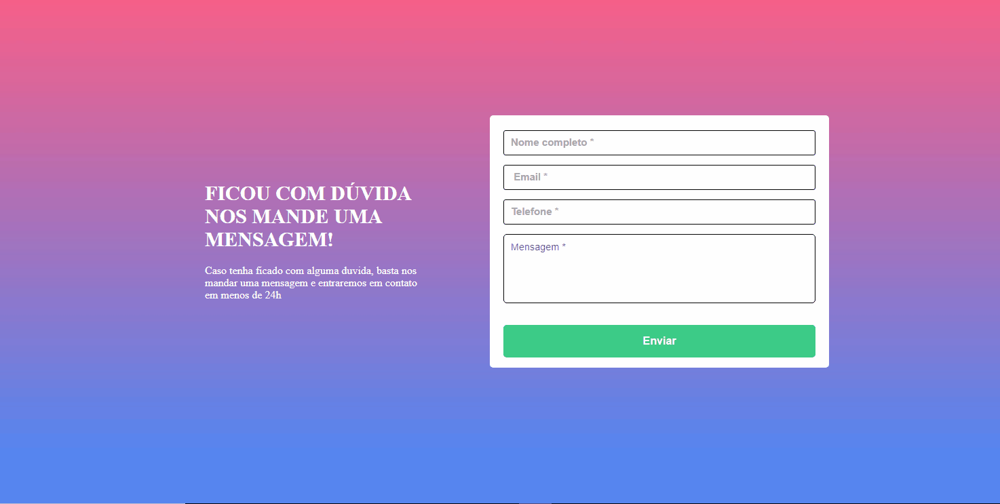

# Formulário
# Descrição
Foi desenvolvido um formulário no React com o Hook Form.
Uma atualização de um formlário, já desenvolvido em outra aula no curso DevQuest. O primeiro foi desenvolvido com HTML e CSS.
Mas deveria ser usado os mesmo critérios.
## Objetivo
- O formulário deveria ser feito com validação de input.
- Deveria ser desenvolvido com o Hook form.
- Estilizado com Styled component.
- Ao clicar para enviar o formulário, se o campo não estivesse preenchido, a borda do input deveria ficar vermelha e uma mensagem de "campo obrigatório" deveria aparecer embaixo do campo que não foi preenchido.
- Quando o campo fosse preenchido, as bordas deveria ficar na cor verde.
- O fundo do formulário deve ser feito usando a imagem em anexo na aula.
## Tecnologias utilizadas

## Layout

